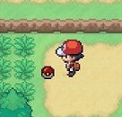

# The FusionMON Challenge
FusionMON is a challenge which has been created to incorporate the [IronMON Challenge](https://gist.github.com/valiant-code/adb18d248fa0fae7da6b639e2ee8f9c1) into [Pokémon Infinite Fusion](https://www.pokecommunity.com/showthread.php?t=347883).

Jump to: | [Rules](#standard-fusionmon-rules) | [Levels](#infinite-fusion-levels) |

Pokémon Infinite Fusion is a fanmade game, based on Pokémon FireRed Version. The game introduces DNA Splicers (from Generation 5) which the player can use on any Pokémon they find in the game. Each combination has a unique sprite, stats, movepool, Pokédex entry, and everything else you could expect from a Pokémon. You can find out about what happens during the Fusion process [here](https://www.reddit.com/r/PokemonInfiniteFusion/comments/b01dyw/fusion_faq/). Use this [Fusion Calculator](https://aegide.github.io/) to see all the potential combinations! [Here](https://infinitefusion.fandom.com/wiki/Differences_with_the_official_games) you can find all of the major changes to the game.

[Game download](https://mega.nz/folder/k4U1WZRa#k-eiqK-5n79fX1BqKUwuuQ) (full game or patch). New updates are uploaded periodically and this link will be kept up to date with the latest versions released. Make sure to join the [Pokémon Infinite Fusion Discord](https://discord.com/invite/vY8Y2m2) for updates.

## Standard FusionMON Randomiser Variables:
| Variable | Details |
|-|-|
| Pokémon | **Area**, Sprites **(OFF)**, Starters **(ON)**, Statics **(ON)**, Gift **(ON)**, Fuse everything **(OFF)** |
| Trainers | Custom sprites **(OFF)** |
| Gym Trainers | Custom sprites **(OFF)**, Gym types **(ON)**, Rerandomise each battle **(OFF)** |
| Items | **Dynamic**, Found items **(ON)**, Found TMs **(ON)**, Given items **(ON)**, Given TMs **(ON)**, Shop items **(OFF)**, Trainer held items **(ON)** |
| Trainer BST Range | Custom **(200)** |
| Wild BST Range | Custom **(200)** |
| Difficulty | **Hard** |
| Autosave | Recommended **ON** |

## Standard FusionMON Rules:
| Rule | Details |
|-|-|
| Permadeath | Once your entire team has wiped, reset the game to a new seed. |
| No replays | If you are unsatisfied with a result, you may not replay. |
| Limited purchases | The only items permitted for purchase are Poké Balls, Splicers and Repels. |
| Single battle trainers | You may only battle each overworld trainer **ONCE** (no rematches). |
| Random Lab starter | You must declare which ball you are going to choose before you see inside it. |
| Favourites | 4 favourite Pokémon can be selected. If any of these Pokémon are in the Lab, but you did not choose it, you may take the favourite instead. |
| Trapped abuse | If you are trapped due to Arena Trap/Shadow Tag/Magnet Pull, you may kill the Pokémon until Poké Balls are obtained for "catch and release". You **MUST** sacrifice one trainer's experience later on. |
| Declaring a main | You must declare which Pokémon is going to be the main **BEFORE** Gym 1. |
| Set mode | Set mode must be activated as soon as possible. |
| Shiny clause | Any shinies found may be caught or killed for experience. |
| No overpowered Pokémon | Only Pokémon below **600BST** may be selected for your team. Legendary & Mythical Pokémon are banned. If all Pokémon are banned in the Lab fight, you must reset but do not count it as an attempt. All Shedinja Fusions are banned. |
| Calculating Fusions | The [Infinite Fusion Calculator](https://aegide.github.io/) may be used during runs to understand typing/stat spreads. |
| Let them grow | If a Pokémon wants to evolve, let them. If an item is found for evolution, you do not have to use it. |
| Banned items | Everstone, Leftovers, Lucky Egg, Eviolite, Soul Dew, Mist Stone, Gender Stone, Gender Ball, Boost Ball, Ability Ball, Virus Ball, Perfect Ball, Candy Ball. Exp. All is banned/must be turned off. |
| x99 item ban | The x99 of one item is banned. You can sell it at the mart or trash them.  |
| Collect once rule | Items in rocks and spider webs are a one-time pickup. Any items collected after initial collection must be trashed. Mushrooms & berry bushes are banned. |
| No yellow balls | TMs in the overworld are yellow Poké Balls. Try your best to avoid picking them up. If you do pick one up, store it in the PC immediately. |
| Flute rule | Any acquired Flutes may only be used **once each per Pokémon Centre heal**. |
| No stealing | Items may not be harvested from wild Pokémon. |
| Catch one per route | Only one Pokémon may be caught per route. Fusions are eligible for catching, but you must declare which Pokémon you will be taking & which you will be releasing. |
| No HM moves in battle | HM moves are not permitted to be used inside of battle. |
| Gym info | You may look at the typing of the Gym before entering. |
| One-shot Gyms & dungeons | You must clear all trainers **BEFORE** the Leader. The Leader must be defeated before you can exit. A dungeon may be re-entered for story purposes. Forests are not considered dungeons. Any leftover experience **must be avoided** during re-entry. |
| Gym Leader TMs | You may use Gym Leader TMs only **once per seed**. All other TMs are not usable. |
| New Fusion before Gyms | One Pokémon must be unfused & fused to a new Pokémon before each Gym (choose wisely). Team member Pokémon must be fused **inside the party selection menu**. |
| Fusion reuse | You may not use a Pokémon which has been fused to your main more than once. |
| Move reminder | You may replace **4 moves per Fusion**. Relearnt moves must be purchased all at once (no saving moves for later). |
| 6-team total | Only 6 Pokémon Fusions are permitted in the team per seed. If a Pokémon faints, they must be permanently placed in the box or released. |
| HM friends | HM friends must be declared. If an HM friend is swapped in during battle due to Whirlwind/Roar, you must switch immediately. The HM friend **MUST HAVE** an ability which will not alter the outcome of the battle. For example, Run Away, Minus, Illuminate etc. will not produce additional effects. |
| Illegal Pokémon | Pokémon which are static, traded, gifted or sold (for example, wondertrade or Black Market) are banned. These Pokémon may be used as HM friends if their ability does not impact the battle. |
| Accidental kills/catches | Any accidental kills should result in immediately leaving the route and discounting any potential catches from the route going forward. Any accidental catches must be released. |

## Infinite Fusion Levels:
| NPC | Team Size | Levels |
|-|-|-|
| Brock | **2** | 9, 12 |
| Misty | **2** | 19, 22 |
| Surge | **3** | 24, 24, 26 |
| Erica | **3** | 33, 33, 35 |
| Koga | **4** | 35, 36, 36, 38 |
| Sabrina | **4** | 41, 41, 42, 45 |
| Blaine | **4** | 47, 47, 49, 51 |
| Giovanni | **5** | 50, 50, 52, 54, 54 |
| Blue (Pre-E4) | **6** | 45, 45, 47, 47, 50, 53 |
| Lorelei | **5** | 53, 54, 54, 57, 57 |
| Bruno | **5** | 53, 53, 54, 57, 57 |
| Agatha | **5** | 55, 55, 55, 57, 58 |
| Lance | **5** | 54, 55, 57, 58, 59 |
| Blue (Champion) | **6** | 58, 59, 59, 60, 61, 64 |
| Whitney | **5** | 55, 55, 56, 56, 58 |
| Kurt | **5** | 56, 56, 58, 58, 62 |
| Falkner | **5** | 58, 58, 60, 61, 63 |
| Chuck (Boon Island) | **5** | 62, 62, 63, 64, 64 |
| Clair | **5** | 62, 62, 63, 63, 66 |
| Morty | **5** | 63, 64, 65, 65, 67 |
| Pryce | **5** | 64, 65, 65, 65, 65 |
| Jasmine (Chrono Island) | **5** | 66, 66, 67, 67, 68 |
| Blue (Mt. Silver) | **5** | 68, 69, 69, 69, 72 |
| Cynthia | **5** | 71, 71, 71, 72, 73 |
| Gold | **6** | 76, 77, 77, 77, 78, 79 |

[Back to top](#the-fusionmon-challenge)
